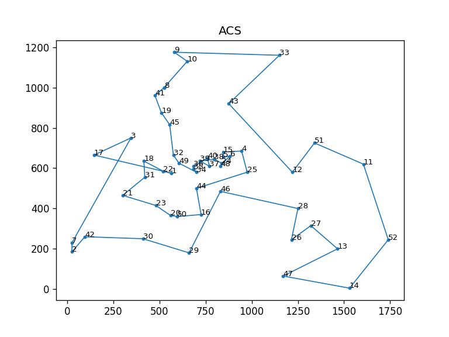
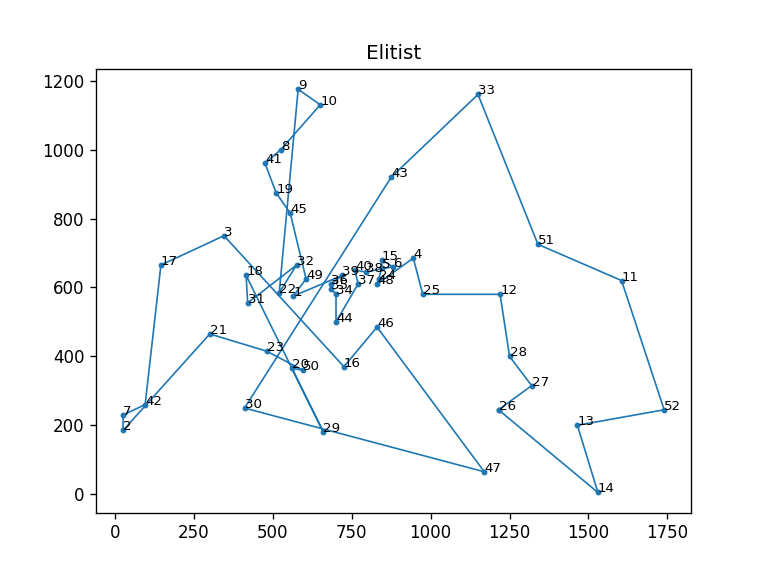
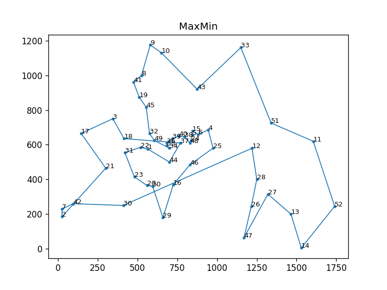
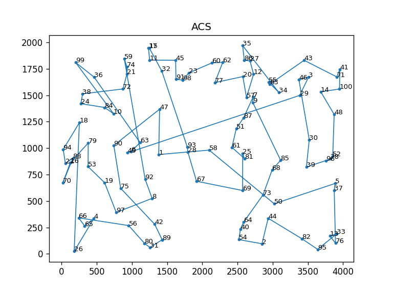
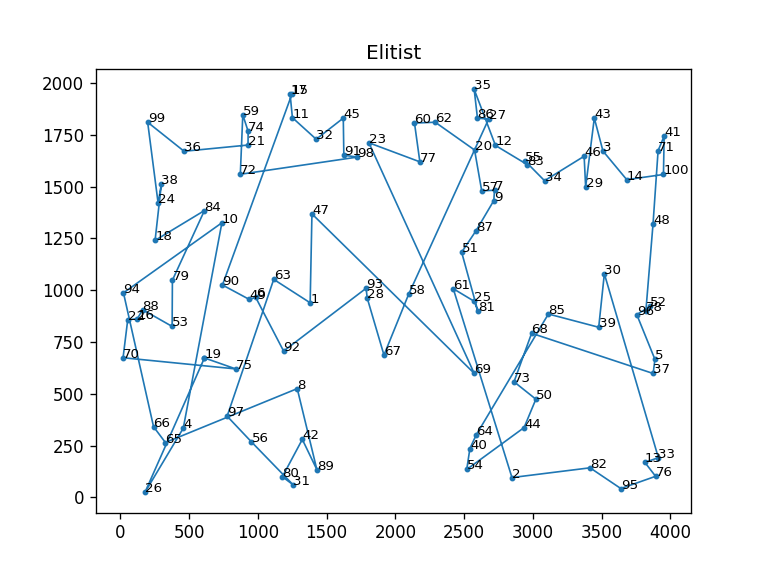
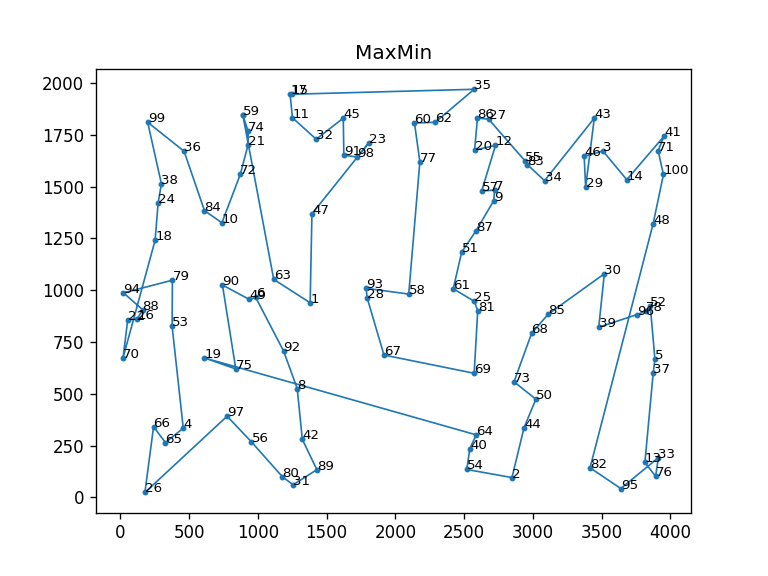

## Solving Travelling Salesman Problem using Ant Colony Optimization

### Install dependencies
`pip install -r requirements.txt`


### Berlin52
```python
_colony_size = 5
_steps = 50
inp = open("datasets/berlin52.tsp", "r")
_nodes = [(float(line.split(" ")[1]), float(line.split(" ")[2]))for i, line in enumerate(inp) if line != "EOF\n" and i > 5 and line != "\n"]
acs = SolveTSPUsingACO(mode='ACS', colony_size=_colony_size, steps=_steps, nodes=_nodes)
acs.run()
acs.plot()
elitist = SolveTSPUsingACO(mode='Elitist', colony_size=_colony_size, steps=_steps, nodes=_nodes)
elitist.run()
elitist.plot()
max_min = SolveTSPUsingACO(mode='MaxMin', colony_size=_colony_size, steps=_steps, nodes=_nodes)
max_min.run()
max_min.plot()
```


#### Plots 
  
   



### kroA100
```python
_colony_size = 5
_steps = 50
inp = open("datasets/kroA100.tsp", "r")
_nodes = [(float(line.split(" ")[1]), float(line.split(" ")[2]))for i, line in enumerate(inp) if line != "EOF\n" and i > 5 and line != "\n"]
acs = SolveTSPUsingACO(mode='ACS', colony_size=_colony_size, steps=_steps, nodes=_nodes)
acs.run()
acs.plot()
elitist = SolveTSPUsingACO(mode='Elitist', colony_size=_colony_size, steps=_steps, nodes=_nodes)
elitist.run()
elitist.plot()
max_min = SolveTSPUsingACO(mode='MaxMin', colony_size=_colony_size, steps=_steps, nodes=_nodes)
max_min.run()
max_min.plot()
```


#### Plots 
  
   

